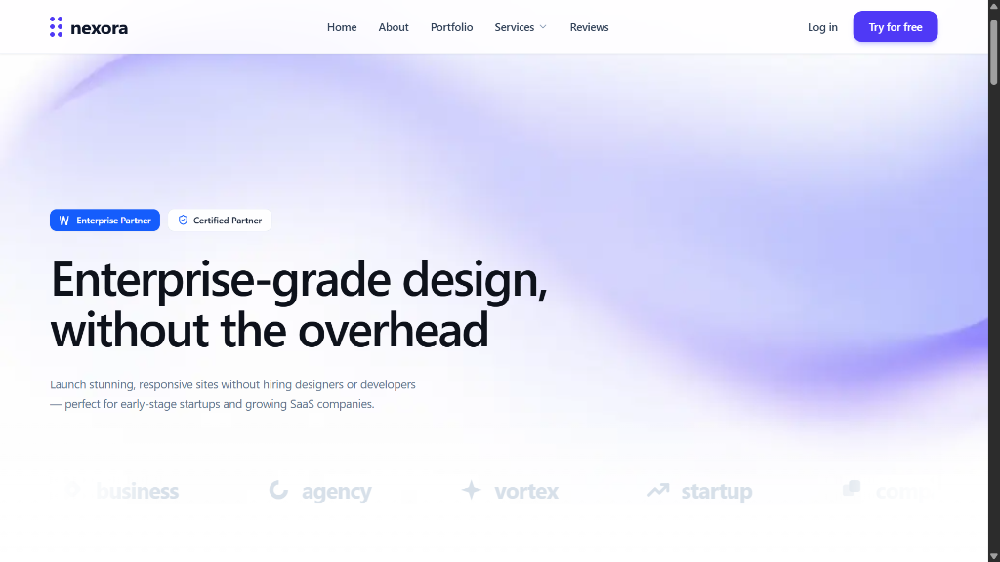

# Nexora — Digital Agency

**Enterprise-grade design, without the overhead.**

Launch stunning, responsive sites — perfect for early-stage startups and growing SaaS companies.

[](https://nextjs.org/)
[](https://www.typescriptlang.org/)
[](https://tailwindcss.com/)

---

## Preview



> **Live Site:** [https://nexora-digital-ui.vercel.app/](https://nexora-digital-ui.vercel.app/)

---

## Features

- **Hero Section** — Bold headline with animated gradient background and partner badges
- **About** — Agency story and value proposition
- **Portfolio / Projects** — Showcase of client work with category filters
- **Services** — Tiered service offerings with feature breakdowns
- **Testimonials** — Client reviews and social proof
- **Contact** — Lead capture form
- **Footer** — Navigation, links, and branding
- **Smooth Animations** — Powered by Framer Motion
- **Fully Responsive** — Mobile-first layout across all breakpoints

---

## Tech Stack

| Technology | Version | Purpose |
|---|---|---|
| [Next.js](https://nextjs.org/) | 16.3.5 | React framework & routing |
| [React](https://react.dev/) | 19 | UI library |
| [TypeScript](https://www.typescriptlang.org/) | 5 | Type safety |
| [Tailwind CSS](https://tailwindcss.com/) | 4 | Styling |
| [Framer Motion](https://www.framer.com/motion/) | 13 | Animations |
| [Lucide React](https://lucide.dev/) | 1.45 | Icons |
| [canvas-confetti](https://github.com/catdad/canvas-confetti) | 1.9 | Confetti effects |

---

## Project Structure

```
nexora-agency/
├── src/
│   ├── app/
│   │   ├── layout.tsx       # Root layout & metadata
│   │   ├── page.tsx         # Home page
│   │   └── globals.css      # Global styles
│   └── components/
│       ├── Navbar.tsx       # Navigation bar
│       ├── Hero.tsx         # Hero / landing section
│       ├── About.tsx        # About the agency
│       ├── Projects.tsx     # Portfolio showcase
│       ├── Services.tsx     # Services offered
│       ├── Testimonials.tsx # Client reviews
│       ├── Contact.tsx      # Contact form
│       └── Footer.tsx       # Site footer
├── public/                  # Static assets
├── next.config.ts
└── package.json
```

---

## Getting Started

### Prerequisites

- [Node.js](https://nodejs.org/) 18+
- npm

### Installation

```bash
# 1. Clone the repository
git clone https://github.com/your-username/nexora-agency.git
cd nexora-agency

# 2. Install dependencies
npm install

# 3. Start the development server
npm run dev
```

Open [http://localhost:3000](http://localhost:3000) in your browser.

### Build for Production

```bash
npm run build
npm run start
```

---

## Deployment

This project is deployed on **Vercel**.

[](https://vercel.com/new/clone?repository-url=https://github.com/your-username/nexora-agency)
